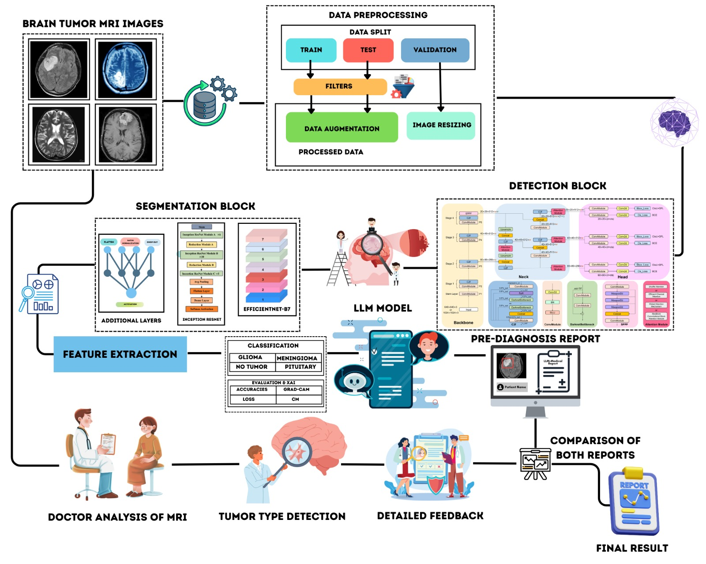
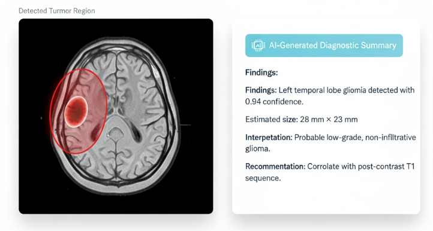

# 🧠 Hybrid Deep Learning + LLM Architecture for Automated Medical Image Segmentation: From Detection to Pre-Diagnosis

**Based on the research paper:**  
📄 *A Hybrid Deep Learning and LLM Architecture for Automated Medical Image Segmentation: From Detection to Pre-Diagnosis (2025)*  

**Authors:** [Dr. Irshad Ibrahim](https://github.com/Dr-irshad) · [Umar Farooq](https://github.com/imumarfarooq)  
**Status:** Under review for journal publication  
**Contact:** irshad@modgenix.com  

---

## 🧩 Repository Status


---

## 🧠 Overview

This repository presents a **Hybrid Deep Learning and LLM Architecture** for automated medical image segmentation and pre-diagnosis generation. The framework integrates **YOLOv8-Attention–based detection** with **LLM-powered diagnostic reasoning (DeepSeek-R1 via Ollama)** to perform end-to-end tumor analysis in neuroimaging. By combining **visual intelligence (deep learning)** with **contextual understanding (language models)**, this system delivers interpretable medical insights directly from MRI scans.

---

## 🚀 Key Highlights

- **Hybrid Deep Learning + LLM Pipeline** – YOLOv8-Attention segmentation + DeepSeek-R1 reasoning via LangChain.  
- **High-Precision Detection** – Pixel-level segmentation accuracy validated on multiple MRI datasets.  
- **Automated Pre-Diagnosis** – LLM generates structured, human-readable clinical summaries.  
- **Explainable AI** – Visual and textual interpretability for clinical decision support.  
- **Scalable Deployment** – Supports cloud (AWS, Azure) and edge (Jetson) inference.

---

## 🧬 Dataset Overview

The model was trained and evaluated on three public MRI datasets, ensuring diverse tumor representation and robust generalization.

| Dataset | Source | Modality | Purpose |
|----------|---------|----------|----------|
| **BRISC 2025** | Brain Imaging & Segmentation Consortium | MRI | Primary training and validation |
| **SARTAJ** | University of Aizu | MRI | Cross-dataset generalization |
| **Mendeley Brain Tumor Dataset** | Mendeley Data | MRI | Benchmark testing |

**Dataset Composition:** 675+ MRI images (annotated + augmented)  
**Annotation Format:** Pixel-level segmentation masks  
**Augmentation:** Rotation, brightness, and noise variations  

### 📊 Dataset Visualization


---

## 🧩 System Architecture

The system integrates a **YOLOv8-Attention segmentation network** with an **LLM-based reasoning layer**, forming an interpretable diagnostic pipeline.

### 🧠 Hybrid Architecture Diagram


### Core Components
1. **Data Acquisition** – MRI/fMRI input & metadata parsing  
2. **Preprocessing & Augmentation** – Normalization, alignment, noise reduction  
3. **Detection Engine (YOLOv8-Attention)** – Segmentation & feature extraction  
4. **LLM Diagnostic Layer (DeepSeek-R1 via Ollama)** – Text-based reasoning and medical interpretation  
5. **Visualization Interface** – Real-time dashboard for overlays and LLM output  
6. **Cloud/Edge Infrastructure** – Scalable deployment for research or hospital integration  

---

## 📊 Performance Metrics

| Metric | Detection Stage | Classification Stage | End-to-End |
|---------|-----------------|----------------------|-------------|
| **Accuracy** | 97.8 % | 96.2 % | **97.1 %** |
| **Recall** | 99.0 % | 95.6 % | **97.3 %** |
| **Precision** | 96.8 % | 95.1 % | **96.0 %** |
| **F1-Score** | 97.9 % | 95.4 % | **96.6 %** |
| **Dice Coefficient** | — | — | **0.90 ± 0.02** |

> The hybrid framework showed a **statistically significant (p < 0.05)** improvement over traditional CNN-only segmentation approaches.

---

## 🧠 LLM Diagnostic Output

After segmentation, the extracted tumor features and contextual data are analyzed by **DeepSeek-R1** (through Ollama), which produces a structured diagnostic narrative.




---

## 🧰 Core Technologies

| Category | Tools & Frameworks |
|-----------|-------------------|
| **Deep Learning** | YOLOv8, TensorFlow, PyTorch |
| **Computer Vision** | OpenCV, Albumentations |
| **LLM Reasoning** | LangChain, Ollama, DeepSeek-R1 |
| **UI Framework** | Streamlit |
| **Deployment** | AWS, Azure, NVIDIA Jetson |
| **Metrics** | Dice, IoU, Precision, Recall, F1-Score |

---

## 📚 Research Context

This study introduces a **hybrid medical AI pipeline** that merges **perceptual understanding** from deep vision models with **reasoning capability** from LLMs.  
It advances the interpretability and trustworthiness of neuroimaging diagnostics — moving beyond raw predictions to **context-aware pre-diagnosis reports**.

---

## 📖 Citation

If you use or cite this work, please reference the following:

> **APA 7th**
> ```
> Ibrahim, I., & Farooq, U. (2025).  
> A Hybrid Deep Learning and LLM Architecture for Automated Medical Image Segmentation: From Detection to Pre-Diagnosis.  
> NeuroPulse Research Group.
> ```

> **IEEE**
> ```
> I. Ibrahim and U. Farooq,  
> "A Hybrid Deep Learning and LLM Architecture for Automated Medical Image Segmentation: From Detection to Pre-Diagnosis,"  
> NeuroPulse Research Group, 2025.
> ```


---

## 🤝 Acknowledgments

- **BRISC**, **SARTAJ**, and **Mendeley Data** contributors for open datasets  
- Developers of **YOLOv8**, **LangChain**, and **Ollama** frameworks  
- **Dr. Irshad Ibrahim** and **Umar Farooq** for conceptual and experimental contributions  

---

## 📜 License

Licensed under the **MIT License**.  
All datasets and models remain the property of their respective creators.

---

> *“This hybrid framework unites perception and reasoning — enabling intelligent, transparent, and clinically meaningful medical AI.”*

